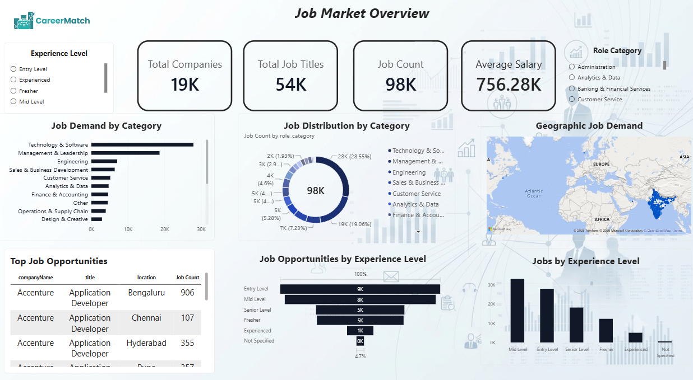

# CareerMatch – Job Market Intelligence & Analytics

### *Understanding the job market through data-driven insights*

CareerMatch is an end-to-end **Job Market Intelligence & Analytics** project developed to analyze **97,000+ job listings** and uncover meaningful patterns across career categories, job roles, skills, salaries, experience levels, locations, companies, and employment opportunities.

The project uses **Python, MySQL, and Microsoft Power BI** to transform raw job-market data into a structured analytical solution and an interactive three-page dashboard.

The dashboard provides a consolidated view of the employment landscape, helping users understand **where hiring demand exists, which skills are in demand, how salaries vary, and where job opportunities are concentrated.**

---

## 📌 Problem Statement

The modern job market contains a large volume of information across job roles, career categories, companies, locations, experience levels, salaries, and required skills. However, this information is often fragmented and difficult to analyze collectively.

Job seekers and career planners may find it challenging to identify **which career areas have strong demand, what skills employers require, how salary varies across roles and experience levels, and where employment opportunities are concentrated.**

Therefore, there is a need for a data-driven analytical solution that can transform a large job dataset into meaningful insights and provide a clear view of the current employment landscape.

---

## 🎯 Project Objectives

The main objectives of CareerMatch are to:

* Analyze overall job-market demand across different career categories and job roles.
* Identify career areas with higher hiring demand.
* Analyze the skills most frequently required by employers.
* Understand the relationship between career categories and skill requirements.
* Examine salary patterns across different roles and experience levels.
* Analyze job opportunities across different locations.
* Understand the distribution of opportunities across experience groups.
* Identify companies and job titles with significant hiring activity.
* Analyze the availability of fresher and entry-level opportunities.
* Present job-market insights through an interactive Power BI dashboard.
* Enable users to explore employment trends using interactive filters and visualizations.

---

## 📊 Dataset

The project uses a large-scale job-market dataset containing **97,682 job listings**.

The dataset includes information related to:

* Job titles
* Companies
* Career categories
* Locations
* Experience requirements
* Salary information
* Skills
* Fresher opportunities
* Job-related attributes

The data was processed and structured to support analysis of job demand, career trends, skill requirements, salary patterns, and employment opportunities.

---

## 🔄 Project Methodology

The project followed an end-to-end data analytics workflow:

```text
Raw Job-Market Data
        ↓
Data Cleaning & Preparation
        ↓
Python-Based Data Processing
        ↓
MySQL Database
        ↓
Data Structuring & Analysis
        ↓
Power BI Data Modeling
        ↓
Interactive Dashboard
        ↓
Job Market Insights
```

### 1. Data Collection

A large job-market dataset containing job listings from different career categories, companies, locations, experience levels, salary information, and skill requirements was used for the analysis.

### 2. Data Cleaning & Preparation

Python was used to inspect, clean, transform, and prepare the raw dataset for further analysis.

The preparation process included handling data-quality issues, standardizing relevant fields, and organizing the information into a structure suitable for database storage and visualization.

### 3. Database Development

The prepared data was organized in **MySQL** to provide a structured environment for storing and managing the job-market information.

The database was organized around job information, skill information, and fresher-opportunity data.

### 4. Data Analysis

The structured dataset was analyzed to identify patterns in:

* Job demand
* Career categories
* Skills
* Salaries
* Experience levels
* Locations
* Companies
* Job titles
* Fresher opportunities

### 5. Power BI Development

Microsoft Power BI was used to create an interactive dashboard consisting of three analytical pages.

The dashboard combines KPIs, charts, maps, tables, slicers, and other visualizations to allow users to explore the job market dynamically.

---

## 🛠️ Tools & Technologies

| Tool / Technology | Purpose                                                |
| ----------------- | ------------------------------------------------------ |
| **Python**        | Data cleaning, transformation and preparation          |
| **MySQL**         | Data storage and database management                   |
| **Power BI**      | Data modeling, visualization and dashboard development |
| **Excel / CSV**   | Dataset handling and initial data processing           |

---
## 📊 Dashboard Preview

The CareerMatch dashboard consists of three interactive Power BI pages, each focusing on a different aspect of the job market.

### Page 1 — Job Market Overview



### Page 2 — Career & Skill Intelligence


### Page 3 — Salary & Opportunity Intelligence


---

# 📈 Power BI Dashboard
📁 Power BI File: The complete interactive dashboard is available in the Dashboard folder.

The CareerMatch dashboard consists of three pages, each focusing on a different aspect of the job market.

---

## 1. Job Market Overview

This page provides a high-level view of the overall employment landscape.

It focuses on:

* Total job listings
* Companies
* Job titles
* Career categories
* Experience groups
* Geographic distribution
* Hiring activity

The page allows users to quickly understand the scale and distribution of opportunities within the dataset.

---

## 2. Career & Skill Intelligence

This page focuses on the relationship between **career demand and employer skill requirements**.

It provides insights into:

* Career-category demand
* High-demand skills
* Skill distribution
* Career and skill relationships
* Salary patterns associated with career areas

This helps identify which career paths are prominent in the dataset and what capabilities employers frequently seek.

---

## 3. Salary & Opportunities

This page focuses on compensation and employment opportunities.

It analyzes:

* Salary patterns
* Salary differences across career categories
* Experience-based salary trends
* Job opportunities across experience groups
* Fresher and entry-level opportunities

This provides a deeper understanding of how compensation and opportunity levels vary across the job market.

---

## 🔍 Key Areas of Analysis

CareerMatch explores the job market through several analytical dimensions:

**Job Demand**
Identifying categories and roles with significant hiring activity.

**Skills**
Understanding the skills most frequently requested by employers.

**Salary**
Analyzing compensation patterns across roles and experience levels.

**Experience**
Examining how job opportunities differ across experience groups.

**Location**
Understanding where employment opportunities are concentrated.

**Companies**
Identifying organizations and employers with notable hiring activity.

**Fresher Opportunities**
Analyzing the availability of opportunities suitable for entry-level candidates.

---

## 💡 Business Value

The analysis provides a data-driven view of the employment landscape that can support:

* Career planning
* Skill-development decisions
* Understanding hiring trends
* Identification of high-demand career areas
* Salary benchmarking
* Evaluation of fresher opportunities
* Job-market research

By combining multiple job-market dimensions into a single interactive dashboard, the project makes large-scale employment data easier to explore and interpret.

---

## 📂 Project Structure

CareerMatch-Job-Market-Analytics/
│
├── README.md
│
├── Dashboard/
│   └── CareerMatch.pbix
│
├── Dataset/
│   └── CareerMatch_Sample_Dataset.csv
│
├── Screenshots/
│   ├── Job_Market_Overview.png
│   ├── Career & Skill Intelligence.png
│   └── Salary_&_Opportunity Intelligence.png
│
└── Documentation/

### 📌 Dataset Note

The analysis was performed using the complete dataset containing **97,682 job listings**.

Due to GitHub file-size limitations, a representative sample dataset is included in this repository for reference and demonstration purposes. The Power BI dashboard was developed using the complete dataset.
```

---

## 📌 Project Highlights

* **97,682+ job listings analyzed**
* Multiple career categories and job roles
* Comprehensive skill analysis
* Salary and experience analysis
* Geographic job-market analysis
* Fresher opportunity analysis
* Interactive three-page Power BI dashboard
* End-to-end workflow using Python, MySQL and Power BI

---

## 🏁 Conclusion

CareerMatch demonstrates how large-scale job-market data can be transformed into meaningful business intelligence using data preparation, database management, analysis, and interactive visualization.

The project provides a consolidated view of **job demand, career categories, skills, salaries, experience levels, locations, and employment opportunities**, turning raw job listings into actionable job-market insights.

